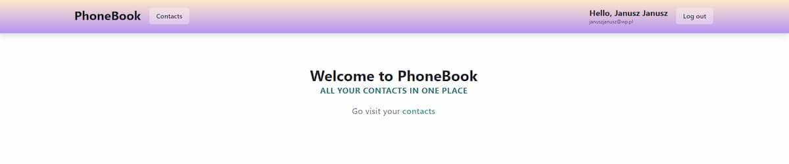
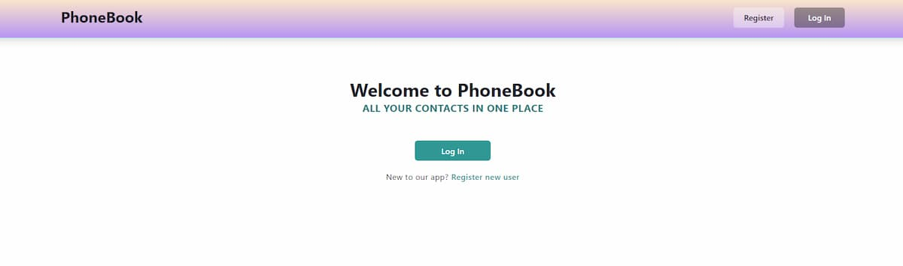
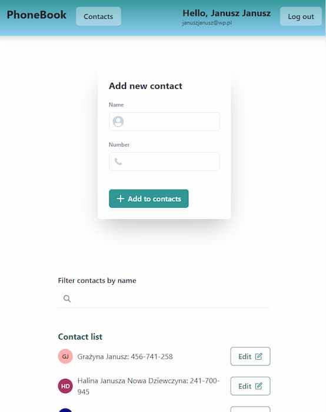
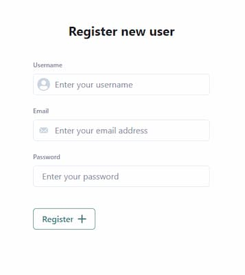
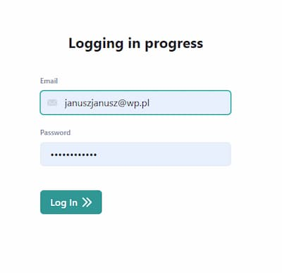
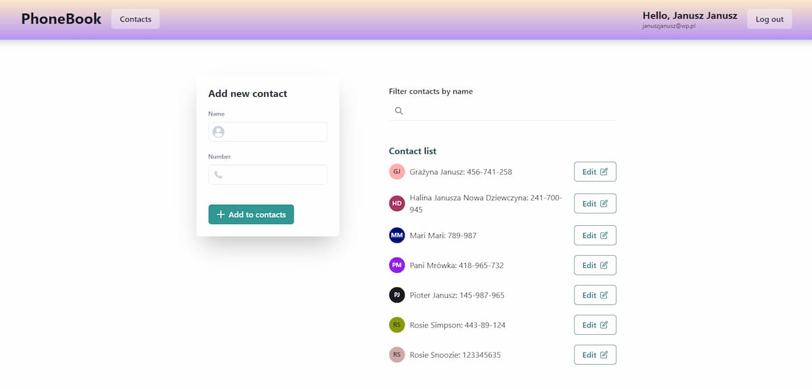
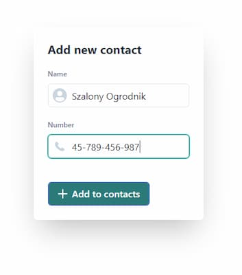
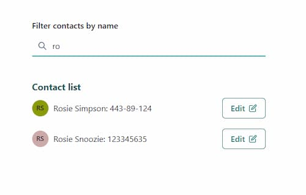

#  Simple phonebook 

One page app using heroku app for backend. Allows to sign up, log in and log out new users. With possibility to menage contacts list like adding, removing and editing contact data with filtering option.
The app is based on Vite & React.js. It includes notilfix notifications and uses axios to get back-end data. The app uses routing from router-dom for client authorization and authentication.

---

## Abouth the Author

- [MarikaGK](https://github.com/MarikaGK/)

---

## Project goal

The aim of the project was to practice working with React.js, and also react-router with usage of private routes, JWT authorization and authentication. I also used ChakraUI library for styling components.

---

## Contents

- [Technologies used](#technologies-used)
- [Installation](#Installation)
- [Activation](#Activation)
- [Scope of functionality](#Scope-of-functionality)
- [Project status](#Project-status)
- [Sources](#Sources)

---

## Technologies used

- `ReactJS version 18.2.0` - work with React reusable components
- `react-router version 6.15.0` - usage of redirections between public and private routes
- `react-redux version 8.1.2` - redux store for managing respondes coming from database
- `redux-persist version 6.0.0` - for client authorization and authentication
- `notiflix version 3.2.6` - user's notifications
- `react-loader-spinner version 5.4.5` - for lazy load of routes
- `ChakraUI version 2.8.0` - styling components, icons, generating contact's avatar

---

## Installation

To install the application, make sure there is LTS version of Node.js installed on your computer  [Download and install](https://nodejs.org/en/)

Then install all dependencies contained in the file package.json by entering the
`npm install` command in the terminal

---

## Activation

According to the `package.json` documentation, to run the project you need to use the `npm run dev` command

---

## GitHub-pages deployment:

Simple phonebook is based on Vite. To deploy your own project, you have to use `npm install gh-pages --save-dev` command

Next you have to add script in package.json:

`"scripts": { "deploy": "npm run build && gh-pages -d dist" },`

And run `npm run deploy` in command line

---

## Scope of functionality

- RWD and user friendly

- Create you account

- Login to your account

- Add contacts to list

- Edit or delete your contact

- Filter contacts list

- Get notifications about your actions

---

## Project status

The basic version of the project has been completed and the application is
working

---

## Sources

The project is based on a project created at the GoIT JavaScript Full Stack
bootcamp Developer. It meets the design criteria imposed during the course and
complements them with additional functionalities I've implemented on my own (functionality of contact edition)

